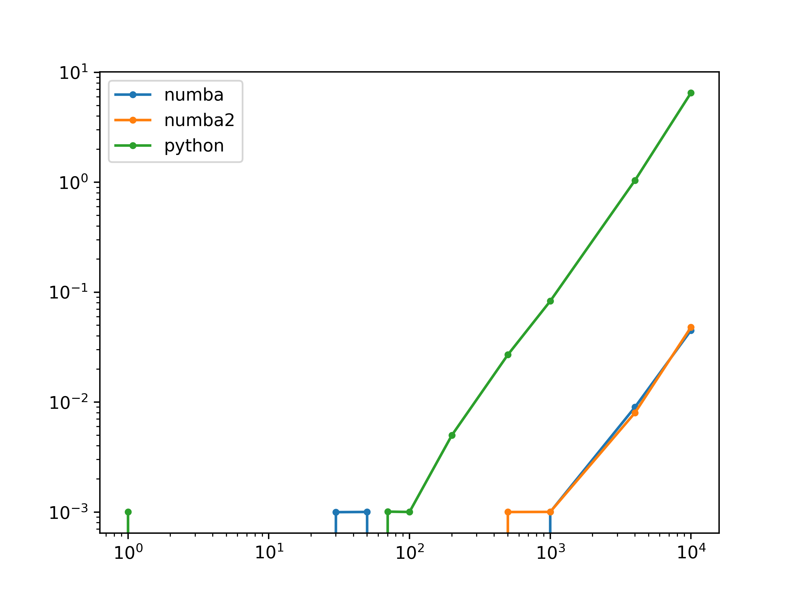

# Backtest

## Example Script

```python
import pandas as pd
from backtest.backtest import BackTest

pred = pd.read_pickle('data/gbdt.pkl')
tester = BackTest(
    start_date='2021-01-01',
    end_date='2022-09-15',
    data_path=r'D:\OneDrive - CUHK-Shenzhen\myfolder\5\qtia\2022-2023\ml-team\baseline\data\AShareEODPrices.csv',
    holding_periods=[1, 2, 5, 10, 20],
    n_groups=10,
    price='close',
    cache_dir='cache'
)
info = tester.alpha_backtest(pred, alpha_shifted=False,
                             plot=True, config={
            # 'holding_period': 20,
            'buy_fee_ratio': 0.00085,
            'sell_fee_ratio': 0.00185,
            'hold_percentage': 0.1
        }, numba=True)
```

## Benchmarking

Speed with/without Numba in strategy backtests.


Speed with/without Numba in simple sampling examples.

